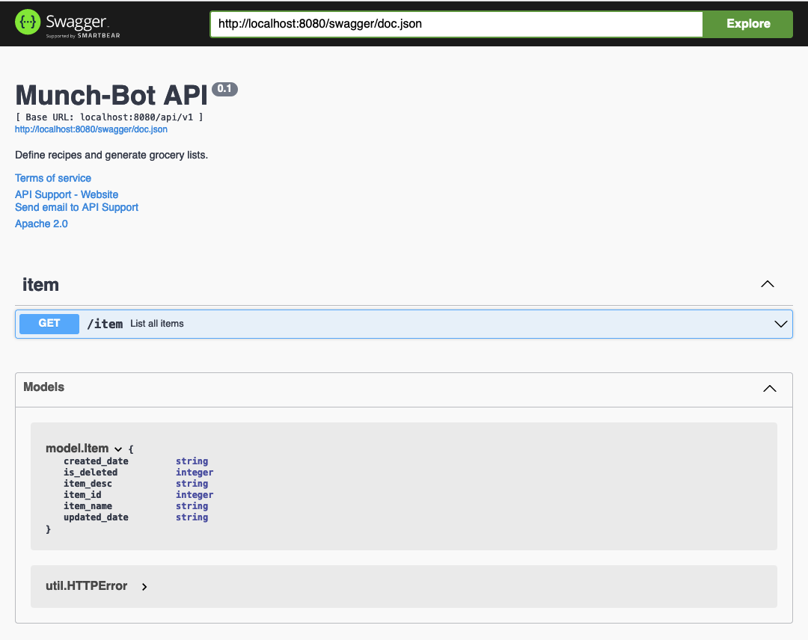

# :ramen: munch-bot

Backend for the grocery application. Allows one to define recipes, 
map ingredients to vendor products, and generate grocery lists.

**Table of Contents:**
- [:ramen: munch-bot](#ramen-munch-bot)
  - [:file\_cabinet: Project Structure](#file_cabinet-project-structure)
    - [:memo: Docs](#memo-docs)
    - [:white\_check\_mark: Tests](#white_check_mark-tests)
    - [:checkered\_flag: Main](#checkered_flag-main)
    - [:monocle\_face: Config](#monocle_face-config)
    - [:computer\_mouse: Controller](#computer_mouse-controller)
    - [:skull\_and\_crossbones: Model](#skull_and_crossbones-model)
    - [:arrows\_counterclockwise: Route](#arrows_counterclockwise-route)
    - [:sos: Util](#sos-util)
  - [:hammer: Build](#hammer-build)
  - [:running\_man: Run](#running_man-run)
  - [:clipboard: Swagger](#clipboard-swagger)

## :file_cabinet: Project Structure

```
munch-bot/
│   README.md
│   makefile  
│   go.sum
│   go.mod
│
└─── docs/
│   │   ...
│   │
└─── test/
│   │   ...
│   │
└─── cmd/
│   │   main.go
│   │
└─── pkg/
│   │
│   └─── config/
│       │   app.go
│   │
│   └─── controller/
│       │   controller.go
│       │   ...
│   │
│   └─── model/
│       │   error.go
│       │   ...
│   │
│   └─── route/
│       │   ...
│   │
│   └─── util/
│       │   error.go
│       │   ...
```

### :memo: Docs

`/munch-bot/docs/...` holds relevant documentation about the project:

[Design Documentation](docs/design.md)

### :white_check_mark: Tests

`/munch-bot/test/...` holds the tests for the project.

### :checkered_flag: Main

`/munch-bot/cmd/main.go` is where the server is started.

### :monocle_face: Config

`/munch-bot/pkg/config/` is where the application is configured. Things like
the `gin` server and the db connection.

### :computer_mouse: Controller

`/munch-bot/pkg/controller/` is where the api requests are processed and
handled.

### :skull_and_crossbones: Model

`/munch-bot/pkg/model/` is where the data schema and data retrieval is
defined.

### :arrows_counterclockwise: Route

`/munch-bot/pkg/route/` is where the api endpoints and request schema
are defined.

### :sos: Util

`/munch-bot/pkg/util/` is where common helper functions are defined.

## :hammer: Build

Prequisites: 
- `go` installed

```bash
go mod install
make build
```
## :running_man: Run

To run the server for testing simply use the make file

```make
make run
```

## :clipboard: Swagger

Prequisites:
- `swag` cli installed

```bash
go install github.com/swaggo/swag/cmd/swag
```

The swagger files are generated in `/munch-bot/docs/swagger/...`

The `openapi.json` is the `swagger.json` converted to `OpenAPI 3.0.1` so that
it can be used for api definition and collection generation in Postman.

To access the swagger documentation simply go to
`http://localhost:8000/swagger/index.html`:

