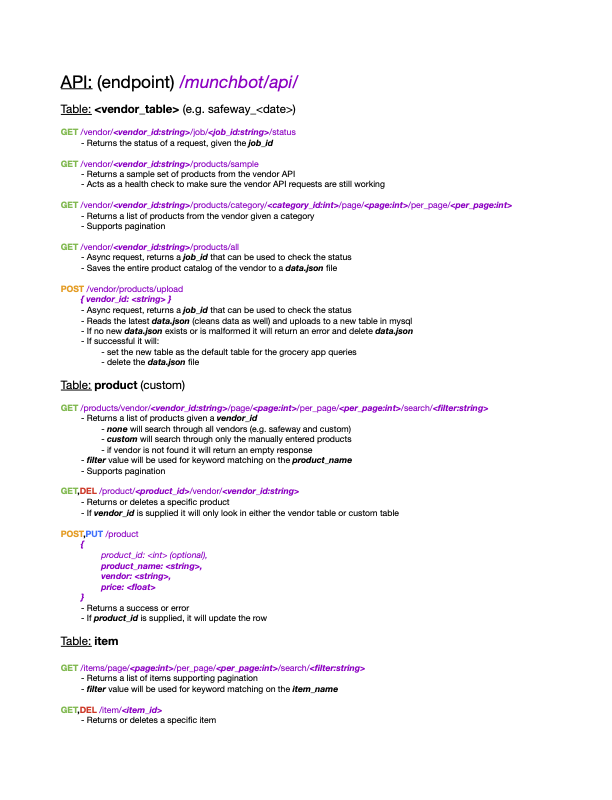
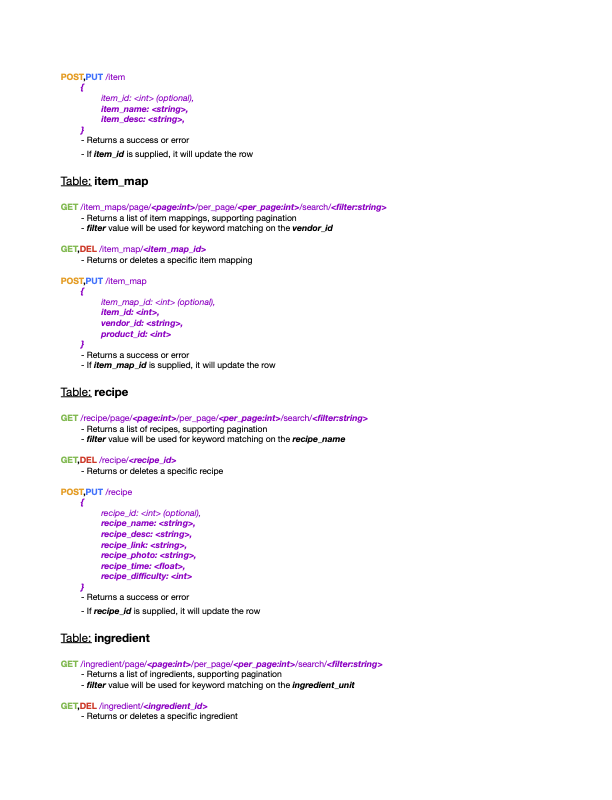
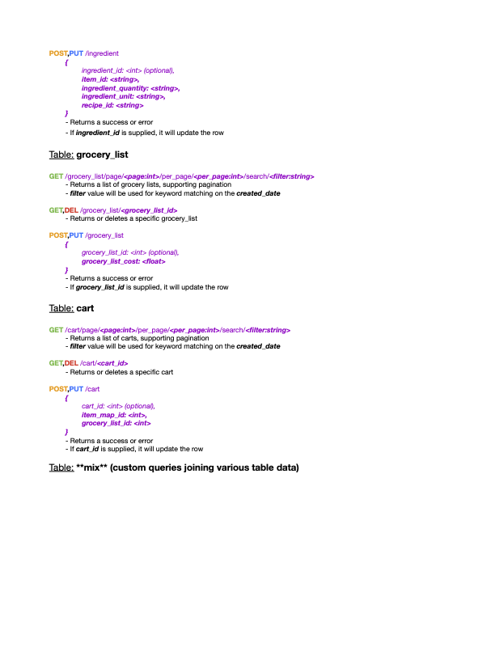
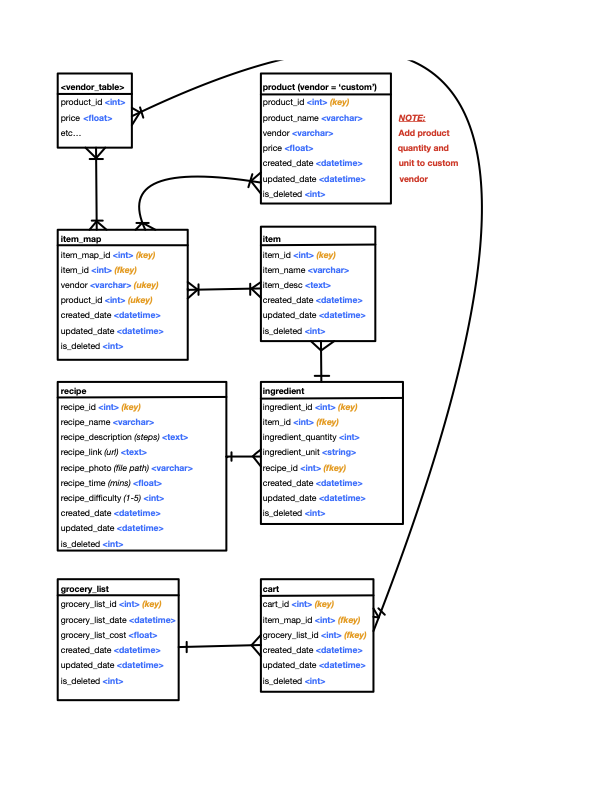

# :art: Design Docs

**Table of Contents:**
- [:art: Design Docs](#art-design-docs)
  - [:computer: API Design](#computer-api-design)
  - [:computer: Entity Relationship Diagram](#computer-entity-relationship-diagram)

## :computer: API Design

## :computer: Entity Relationship Diagram

